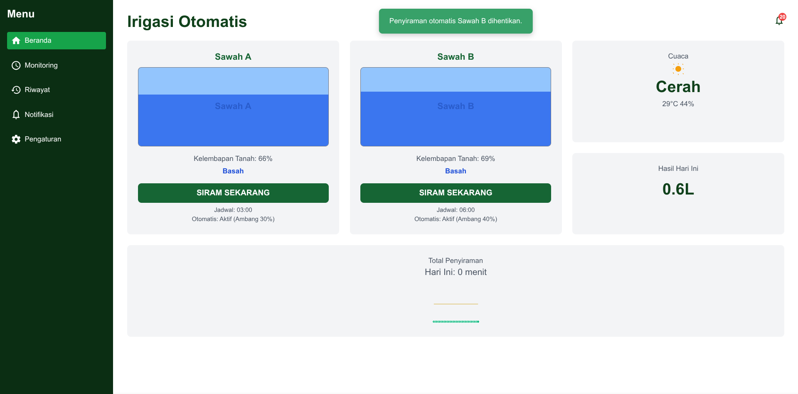
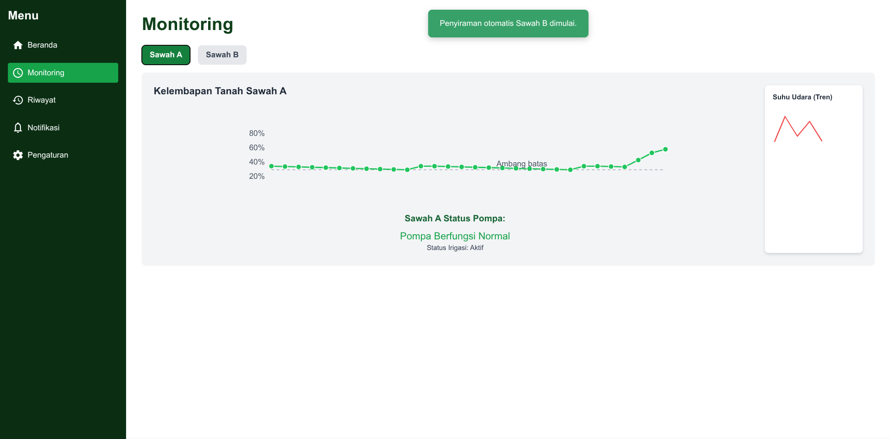
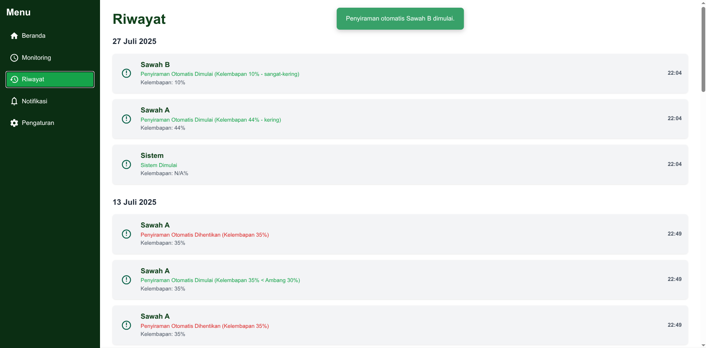
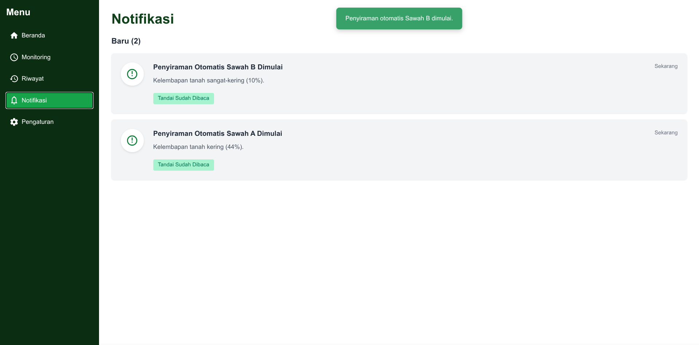
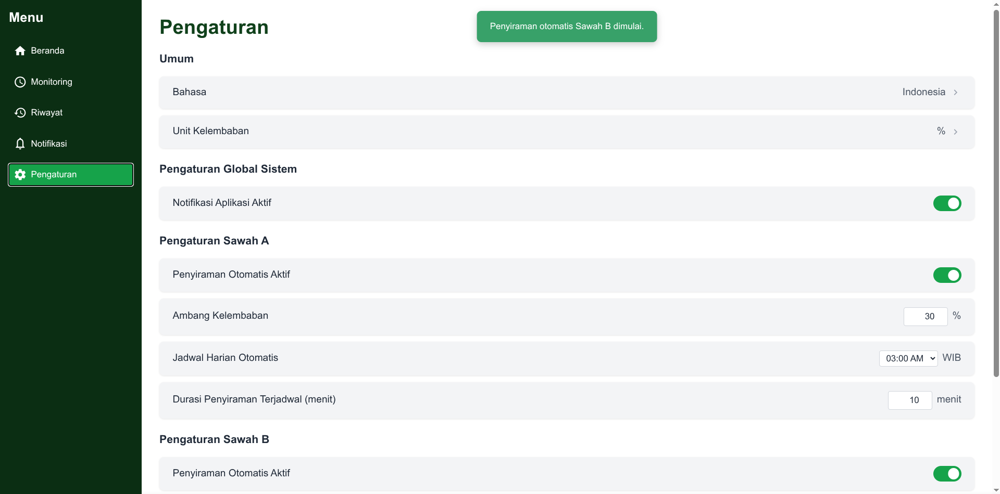

# 💧 Sistem Irigasi Otomatis (Simulasi Real-time)

Selamat datang di repositori Sistem Irigasi Otomatis – sebuah aplikasi simulasi berbasis web yang dirancang untuk memantau dan mengontrol kelembapan tanah di area persawahan secara otomatis maupun manual. Proyek ini memberikan gambaran fungsionalitas sistem irigasi cerdas melalui antarmuka pengguna yang interaktif dan responsif.
---

## 🎯 Fitur Utama

- **Manajemen Buku**:  Memantau tingkat kelembapan tanah di dua sawah (Sawah A dan Sawah B) secara dinamis, bereaksi terhadap kondisi cuaca dan aktivitas penyiraman.
- **Peminjaman Buku**: Pengguna dapat secara langsung memulai atau menghentikan penyiraman untuk sawah tertentu.
- **Katalog Buku**: Sistem secara otomatis menyiram sawah ketika kelembapan tanah turun di bawah ambang batas yang ditentukan.
- **Manajemen Denda**: Pengguna dapat mengatur jadwal harian untuk penyiraman otomatis pada waktu dan durasi tertentu.
- **Statistik Perpustakaan**: Kondisi cuaca (cerah, berawan, hujan) berubah secara acak dan memengaruhi tingkat kelembapan tanah.
- **Manajemen Pengguna**:Menerima pemberitahuan tentang status irigasi, perubahan kelembapan ekstrem, dan interaksi pengguna. Dilengkapi dengan notifikasi pop-up di layar dan halaman notifikasi terpisah.
- **Antarmuka Modern**:  Mencatat semua peristiwa penyiraman dan sistem untuk tinjauan historis.
- **Pengaturan Kostom**:  Mengonfigurasi ambang kelembapan, durasi penyiraman terjadwal, dan preferensi notifikasi untuk setiap sawah.
- **Visualisasi Sawah**:  Representasi visual interaktif sawah yang menunjukkan tingkat kelembapan dan status penyiraman.

---

## 🖼️ Penjelasan Antarmuka

### 1. Beranda (Dashboard)
Halaman utama yang menampilkan ringkasan status sawah, cuaca terkini, hasil penyiraman harian, dan grafik total durasi penyiraman. Dari sini, pengguna dapat dengan cepat melihat kondisi umum dan memulai/menghentikan penyiraman manual.


### 2. Monitoring
Menyediakan tampilan detail kelembapan tanah untuk sawah yang dipilih, lengkap dengan grafik tren kelembapan real-time dan garis ambang batas irigasi otomatis. Anda dapat memilih sawah mana yang ingin dimonitor.


### 3. Riwayat (History)
Menampilkan log kronologis semua peristiwa penting dalam sistem, seperti dimulainya/dihentikannya penyiraman (manual dan otomatis) beserta data kelembapan terkait dan waktu kejadian.


### 4. Notifikasi (Notifications)
Halaman yang berisi daftar semua pemberitahuan sistem, termasuk peringatan kelembapan, status irigasi, dan konfirmasi. Pengguna dapat menandai notifikasi sebagai sudah dibaca untuk mengelola daftar.


### 5. Pengaturan (Settings)
Memungkinkan konfigurasi parameter sistem, seperti mengaktifkan/menonaktifkan notifikasi aplikasi secara global, serta mengatur ambang kelembapan, mengaktifkan/menonaktifkan irigasi otomatis, dan menentukan jadwal/durasi penyiraman otomatis untuk masing-masing sawah.



---

## ⚙️ Teknologi yang Digunakan

- **HTML5**: Struktur dasar halaman web.
- **CSS3 (Tailwind CSS)**: Kerangka kerja CSS untuk styling cepat dan responsif, memastikan tampilan modern dan bersih.
- **JavaScript (React.js)**: Library JavaScript untuk membangun antarmuka pengguna interaktif dan mengelola state aplikasi secara efisien.
- `react@18`: Core react Library
- `react-dom@18`: Untuk rendering React ke DOM.
- `@babel/standalone/babel.min.js`: Digunakan untuk kompilasi JSX langsung di browser (cocok untuk pengembangan atau demo sederhana).

---


## 🚀 Instalasi & Penggunaan

### 1. Clone Repositori

Buka terminal (Command Prompt/PowerShell di Windows, Terminal di macOS/Linux) dan jalankan:

```bash
git clone https://github.com/areksaxyz/SistemIrigasiOtomatis
cd SistemIrigasiOtomatis
```
